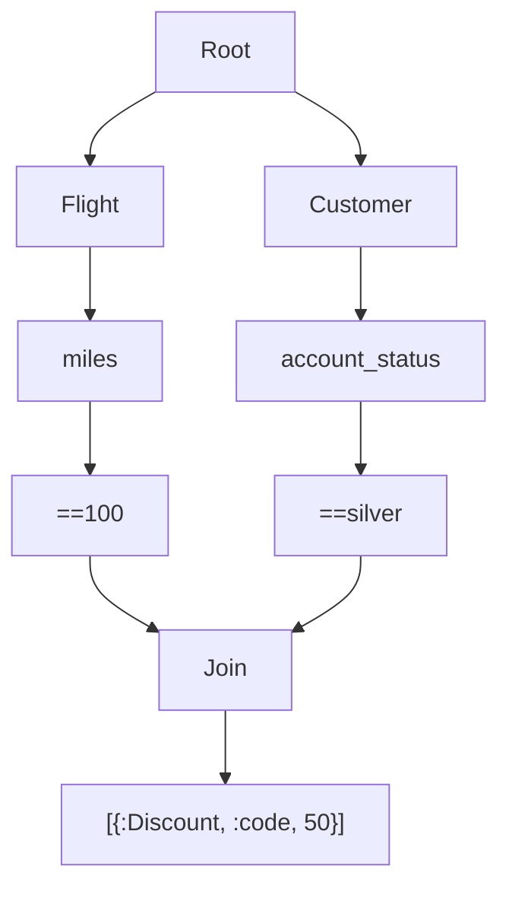
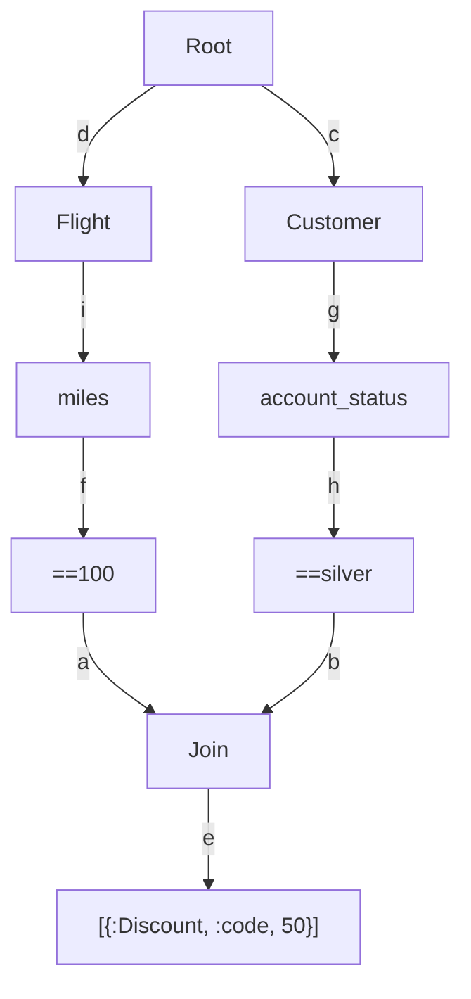

# Retex


# The Rete Algorithm


"The Rete Match Algorithm is an efficient method for comparing a large collection of patterns to a large collection of objects. It finds all the objects that match each pattern. The algorithm was developed for use in production system interpreters, and it has been used for systems containing from a few hundred to more than a thousand patterns and objects" - C. Forgy

**Boilerplate/PoC of a version of the Rete Algorithm implementated in Elixir**

Rete is a complex stateful algorithm, this is an attempt of reproducing it with some slight modifications, using a functional immutable language such as Elixir/Erlang. [Read more about Rete](http://www.csl.sri.com/users/mwfong/Technical/RETE%20Match%20Algorithm%20-%20Forgy%20OCR.pdf)

## Requirements

- Erlang/OTP 24
- Elixir 1.14.2 (compiled with Erlang/OTP 22)


## How does it work?

The algorithm creates an internal representation of the world using symbols. Each "thing" in the real word is converted into a triple `{Entity, attribute, attribute_value}`, this triple is also called "WME" that stands for Working Memory Element.

The world is represented with facts (the WMEs) and Rules. A rule is nothing but a struct made of two important part: `give` and `then` or also called right and left side respectively.

In order to execute inference the rule creates a directed graph that starts with a common and generic Root node and creates leafs branching out of it. The only branches out of a Root node can be the first part of the WME (the working memory elements) and so our "Entity". For example if we want to represent a customer's account status that is "silver" we would encode it as "{Customer, account_status, silver}". But since we have a struct for it we can also do: `Retex.Wme.new("Customer", "account status", "silver")`.

Let's see what this would look if we compile the rete algorithm with Retex:

```mermaid
 flowchart
    2332826675[==silver]
    3108351631[Root]
    3860425667[Customer]
    3895425755[account_status]
    3108351631 --> 3860425667
    3860425667 --> 3895425755
    3895425755 --> 2332826675
 ```
 **example nr. 1**

Now we can see how we have a graph with 4 nodes, and in order:

1. The Root node
   1. this node works as a root of all type nodes (Account, Customer, God, Table, etc..)
2. The Customer node
   1. is also called a Type node and does nothing but storing each known "type" of entity that the algorithm knows about
3. The account_status node
   1. is also called a Select node and represent the attribute name of the entity we are describing
4. the ==silver node
   1. is also called a Test node and you will notice the `==` which is indicating that what ever the value of Customer.account_status is to be checked against `== silver` and so it has to be the literal string silver in this case


As you can imagine we can now keep adding more and more mapping to the real word using any triple we want, let's add for example the entity that represent a Flight and in particular the number of miles of a flight, we can say we have `{Flight, miles, 100}` to make the case that in our system there is a flight with that number of miles.
Let's add this to our network and check what kind of graph we will get:

```mermaid
flowchart
    2102090852[==100]
    2332826675[==silver]
    3108351631[Root]
    3801762854[miles]
    3860425667[Customer]
    3895425755[account_status]
    4112061991[Flight]
    3108351631 --> 3860425667
    3108351631 --> 4112061991
    3801762854 --> 2102090852
    3860425667 --> 3895425755
    3895425755 --> 2332826675
    4112061991 --> 3801762854
```

**example nr. 2**

Now we start to see that we can model more complex scenarios, let's imagine that we want to add our first inference to the network (our first rule).

We want to encode the fact that when the Customer.account_status is "silver and the Flight.miles are exactly "100" we want to add a discount to our Customer entity.

Let's see how our network will look like after adding such rule:




Now we have built our network and it has a symbolic representation of the world and the description of the relationship between multiple entities and their values to trigger a rule (the last node {:Discount, :code, 50}).

## How do we read that graph?

Let's go step by step:

1. At the first level we have the Root which is just a placeholder
2. At the second level we have the nodes Flight and Customer (notice how they branch out of Root and are at the same level)
3. Now both Flight and Customer branch out only once because they both have only one attribute
4. Each of their attribute branches yet once again (==100 and ==silver) to signify that if we get such thing as Customer.account_status we should test that such status is indeed "silver)
5. Those last two nodes both join exactly one new anonymous node that we haven't seen before: the Join node
6. The Join node branches out only once pointing at the right hand side of the rule (aka production node)


## What are join nodes?

Join nodes are also what is called "beta memory" in the original C. Forgy paper. To make it simple we can assert that they group together a set of conditions that need to be true in order for a rule to fire. In our last example the rule is:

```
# pseudocode
given: Flight.miles == 100 and Customer.account_status == "silver"
then: Discount.code == 50
```

The `Join` node in the graph represent the `AND` in the `given` and we will see shortly how it is used. One thing to notice is that the `Join` node has and will only be able to have only 2 parents (incoming edges) and this is very important.


## What are production nodes?

Production nodes are named after their original name in the Forgy paper and they are simply the right hand side of a rule (a `given`). They are only always connected to 1 incoming Join node.


## How do we use all of that after we built the network?

Once we have a graph like the following and we know how to read it let's imagine we want to use to make inference and so to understand if we can give out
such discount code to our customer.


This process is called adding WMEs (working memory elements) to the network. As you might have already guessed there is very little difference between a WME and a part of a rule.

`Retex` exposes the function `Retex.add_wme(t(), Retex.Wme.t())` which takes the network itself and a WME struct and tries to activate as many nodes as possible traversing the graph from the Root until each reachable branch executing a series of "tests" at each node. Let's see step by step how it would work.

Let's rewrite that same graph adding some names to the edges so we can reference them in the description:



Let's see what happens when adding the following working memory element to the Retex algorithm `Retex.Wme.new(:Flight, :miles, 100`

1. Retex will receive the WME and start testing the network from the Root node which passes down anything as it doesn't test for anything
2. The `Root` branches out in `n` nodes (Flight and Customer)
   1. the branch `d` will find a type node with value "Flight" and this is the first part of the WME so the test is passing
      1. the next branch from `d` is `i` which connects Flight to `miles` and so we test that the second part of the triple is exactly `miles`: the test is passing again
         1. the next branch from `i` is `f` which finds a test node `== 100` which is the case of our new WME and so the test is passing
            1. next is `a` which connects to the `Join` node which needs to be tested: a test for a Join node asserts that all incoming connections are active (their test passed) and given that the branch `b` is not yet tested the traversal for now ends here and the Join remains only 50% activated
   2. the second branch to test is `c` which connects to `Customer` and this is not matching `Flight` so we can't go any further

After adding the WME `Retex.Wme.new(:Flight, :miles, 100)` the only active branches and nodes are d, i, f and a

Our rule can't be activated because the parent node `Join` is not fully active yet and so it can't propagate the current WME to the production node (which is sad but fair)


Let's see what happens when adding the following working memory element to the Retex algorithm `Retex.Wme.new(:Customer, :account_status, "silver")`

1. Retex will receive the WME and start testing the network from the Root node which passes down anything as it doesn't test for anything
2. The `Root` branches out in `n` nodes (Flight and Customer)
   1. the branch `c` will find a type node with value "Customer" and this is the first part of the WME so the test is passing
      1. the next branch from `c` is `g` which connects Customer to `account_status` and so we test that the second part of the triple is exactly `account_status`: the test is passing again
         1. the next branch from `h` finds a test node `== "silver"` which is the case of our new WME and so the test is passing
            1. next is `b` which connects to the `Join` node which needs to be tested: a test for a Join node asserts that all incoming connections are active (their test passed) and given that the branch `a` is also already active (we stored that in a map) we can continue the traversal
               1. Now we find a production node which tells us that the Discount code can be applied
   2. the second branch to test is `d` which doesn't match so we can stop the traversal

After adding the WME `Retex.Wme.new(:Customer, :account_status, "silver")` all nodes are active and so the production node ends up in the agenda (just an elixir list to keep track of all production nodes which are activated)

We have now done inference and found an applicable rule. All we need to do now is to add the new WME to the network to check if any other node can be activated in the same way.

Now imagine adding more and more complex rules and following the same strategy to find activable production nodes. The conditions will all be joined by a `Join` (and) node
and will point to a production.

## Concepts

- Retex compiles the rules using a directed acyclic graph data structure
- The activation of nodes is done using a [State Monad and Forward Chaining](https://www.researchgate.net/publication/303626297_Forward_Chaining_with_State_Monad).
- A list of bindings is stored at each active node in order to generate complete matches from partial ones

## Installation

```elixir
def deps do
  [
    {:retex, git: "https://github.com/lorenzosinisi/retex"}
  ]
end
```

## Installation using the wrapper NeuralBridge

If you want you can have a predefined generic DSL and the wrapper NeuralBridge so that you don't have to build the rest of the Expert System from zero

```elixir
def deps do
  [
    {:neural_bridge, git: "https://github.com/lorenzosinisi/neural_bridge"}
  ]
end
```

## Examples and usage with NeuralBridge (a wrapper around Retex)

### Generic inferred knowledge

```elixir
    alias NeuralBridge.{Engine, Rule}
    engine = Engine.new("test")

    rules = [
      Rule.new(
        id: 1,
        given: """
        Person's name is equal "bob"
        """,
        then: """
        Person's age is 23
        """
      ),
      Rule.new(
        id: 2,
        given: """
        Person's name is equal $name
        Person's age is equal 23
        """,
        then: fn production ->
          require Logger
          bindings = Map.get(production, :bindings)
          Logger.info(inspect(bindings))
        end
      )
    ]

    engine = Engine.add_rules(engine, rules)
    engine = Engine.add_facts(engine, "Person's name is \"bob\"")
    rule = List.first(engine.rule_engine.agenda)
    engine = Engine.apply_rule(engine, rule)

    Enum.each(engine.rule_engine.agenda, fn pnode ->
        Engine.apply_rule(engine, pnode)
        end)
    end # will log %{"$name" => "bob"}

```

### Medical diagnosis

```elixir
    alias NeuralBridge.{Engine, Rule}
    engine = Engine.new("doctor_AI")

    engine =
      Engine.add_rules(engine, [
        Rule.new(
          id: 1,
          given: """
          Patient's fever is greater 38.5
          Patient's name is equal $name
          Patient's generic_weakness is equal "Yes"
          """,
          then: """
          Patient's diagnosis is "flu"
          """
        ),
        Rule.new(
          id: 2,
          given: """
          Patient's fever is lesser 38.5
          Patient's name is equal $name
          Patient's generic_weakness is equal "No"
          """,
          then: """
          Patient's diagnosis is "all good"
          """
        )
      ])

    engine =
      Engine.add_facts(engine, """
      Patient's fever is 39
      Patient's name is "Aylon"
      Patient's generic_weakness is "Yes"
      """)

    ## contains Patient's diagnnosis
    [
      %_{
        action: [
          %Retex.Wme{
            identifier: "Patient",
            attribute: "diagnosis",
            value: "flu"
          }
        ],
        bindings: %{"$name" => "Aylon"}
      }
    ] = engine.rule_engine.agenda

```

## Test

- Run `mix test`

## Benchmark adding 20k rules and triggering one

- Run `elixir benchmark/rule_chain.exs`

## Warnings

- Use at your own risk
- This is just a template for complexer implementations of the described algorithms

## Resources and documentation

- [Rete](https://cis.temple.edu/~giorgio/cis587/readings/rete.html)
- [Retex at ElixirConf EU](https://www.youtube.com/watch?v=pvi5hURNzbk&ab_channel=CodeSync)
